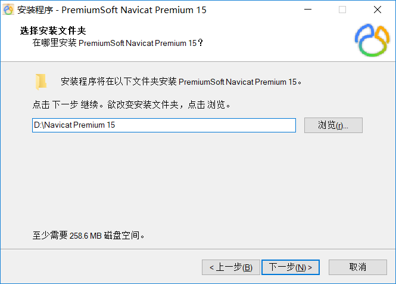
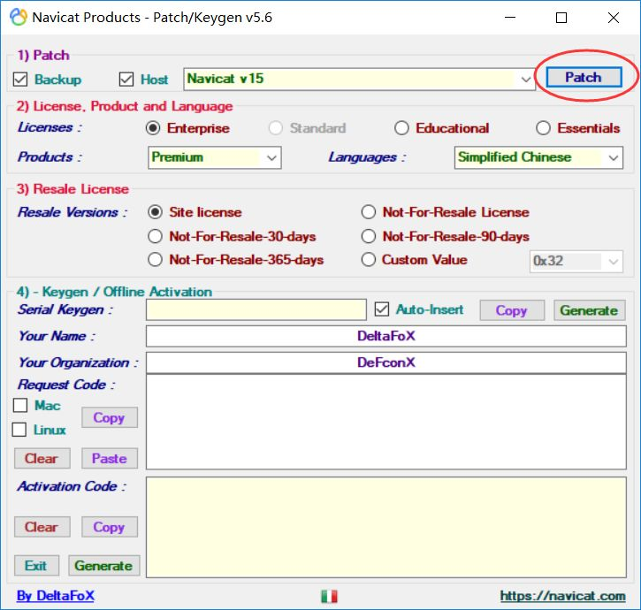
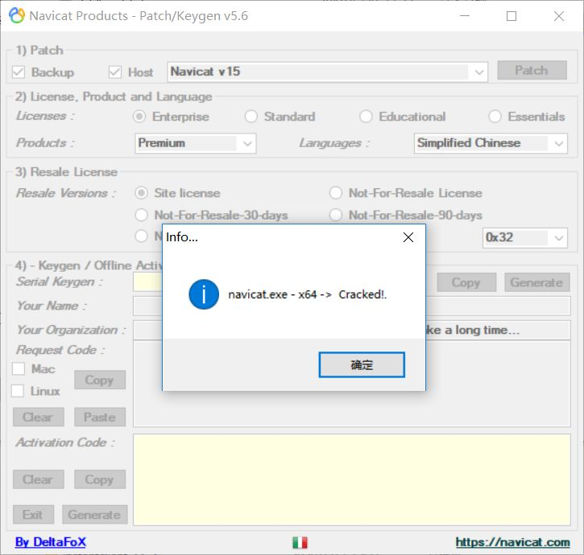
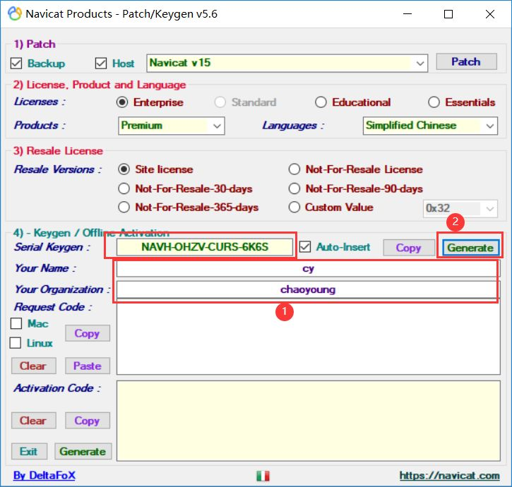
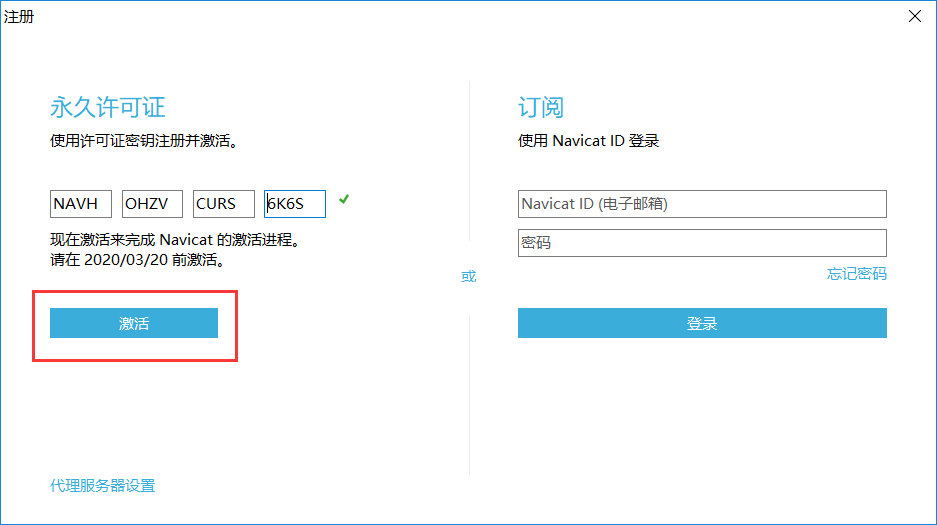
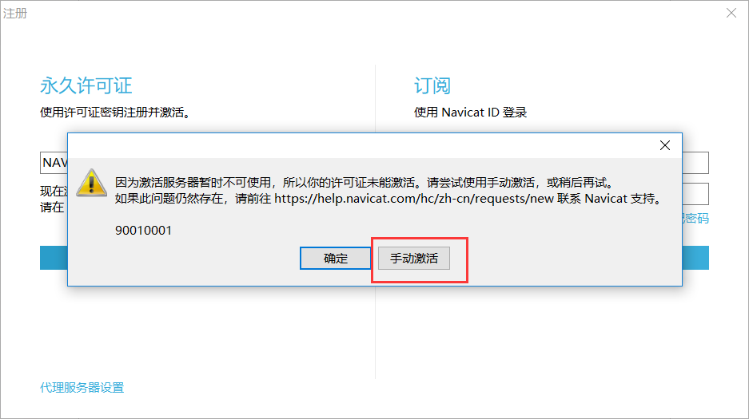
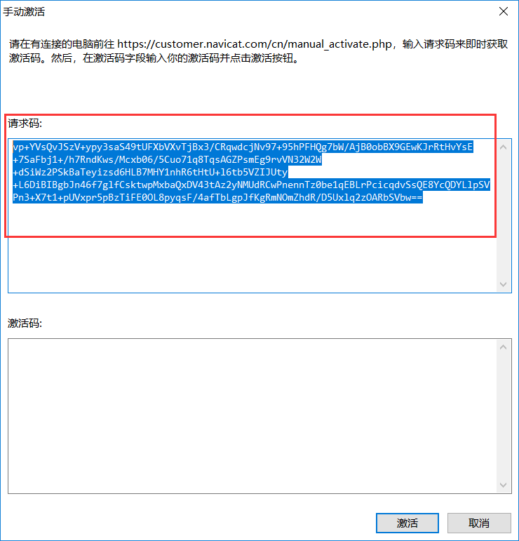
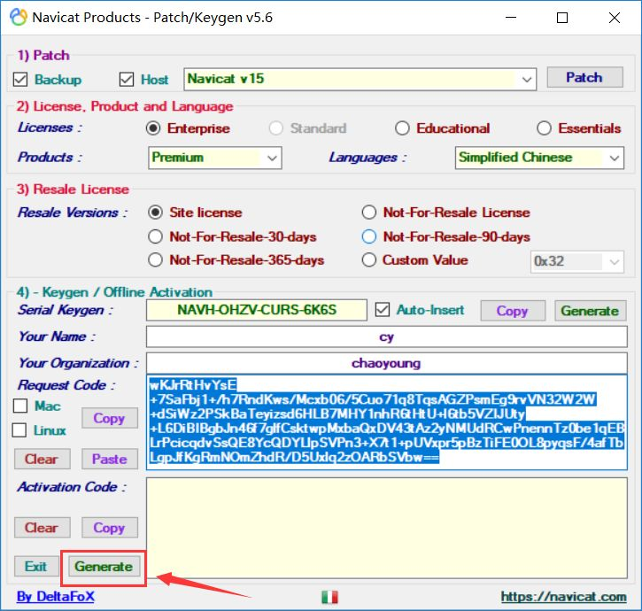
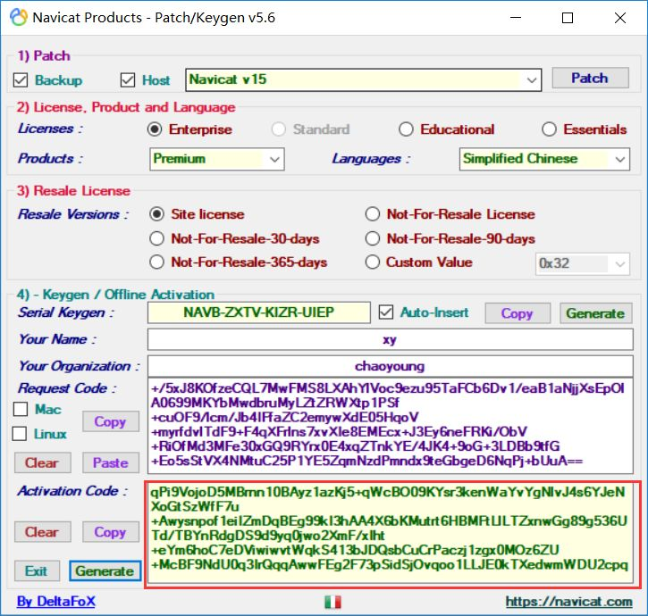
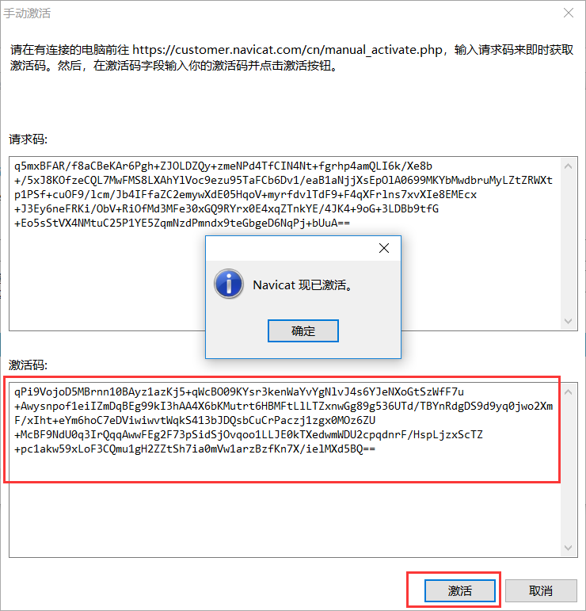

# windows 10 安装 & 破解激活
## 安装 Navicat Premium 15

下载安装包[请点此处](https://github.com/YoujiaZhang/Navicat-Premium-15/releases/download/1.0/navicat150_premium_cs_x64.exe)

选择电脑中的风水宝地安装
安装完成后
- **不要启动！！**  
- **不要启动！！**  
- **不要启动！！**  

接下来我们进行破解激活。
## 运行注册机 

下载注册机[请点此处](https://github.com/YoujiaZhang/Navicat-Premium-15/releases/download/1.0/Navicat.Keygen.Patch.v5.6.0.DFoX.exe)

- **激活时必须断网！**
- **激活时必须断网！**
- **激活时必须断网！**

下载成功后运行注册机，点击右上角 **Patch** 按钮，选择刚才 navicat 安装目录里的 **exe** 文件，如下图所示

License 里选中 Enterprise、在 Produce 里选择 **Premium**、在 Languages 里选择 **Simplified Chinese (简体中文)**

输入 Your Name 和 Your Organization (可随意输入，也可使用默认的),点击 Generate 按钮生成注册码，如下所示

## 运行 navicat
然后运行 navicat ，点击注册，将上面生成的注册码复制到许可证产品密钥栏中，如下所示。

点击激活，然后选择 **手动激活**。

将上面的请求码复制到注册机的 Request Code 中，点击 Generate 按钮。

注册机中返回 Activation code 即为成功，如下所示

此时手动激活页面的激活码会被自动填充，点击激活即可。

## 如果经济允许，还是希望可以支持正版！！！
